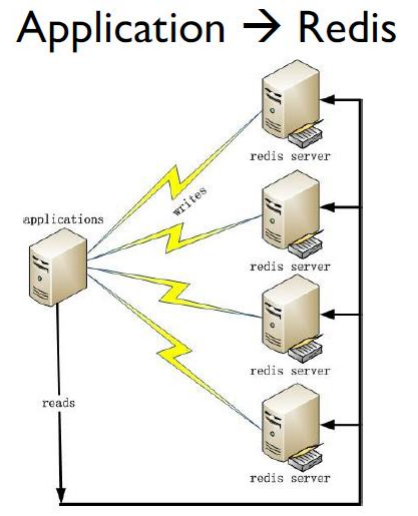
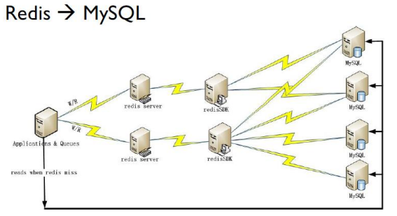

# redis

## redis简介
Redis 是完全开源免费的，是使用C语言编写、支持网络、基于内存（亦可持久化）的高性能的key-value内存数据库，可以用作数据库、缓存和消息中间件。

[中文网站](http://redis.cn)

[官方网站](http://redis.io)

### [深入学习 Redis（1）：Redis 内存模型](www.cnblogs.com/kismetv/p/8654978.html)
### [深入学习 Redis（2）：持久化](www.cnblogs.com/kismetv/p/9137897.html)
### [深入学习 Redis（3）：主从复制](http://www.cnblogs.com/kismetv/p/9236731.html)
### [深入学习 Redis（4）：哨兵](www.cnblogs.com/kismetv/p/9609938.html)

#### Redis 有三个主要的特点, 有别于其它很多竞争对手
* Redis支持数据的持久化，可以将内存中的数据保持在磁盘中，重启的时候可以再次加载进行使用。

* Redis不仅仅支持简单的key-value类型的数据，同时还提供 string(字符串)、list(链表)、set(集合)、zset(sortedset--有序集合)和hash（哈希类型）数据结构的存储。

* Redis支持主从同步数据备份。 数据可以从主服务器向任意数量的从服务器上同步，从服务器也可以是关联其他从服务器的主服务器，即master-slave模式的数据备份。

#### Redis优点
* 性能极高：Redis能读取速度约110000次/s，写入速度约81000次/s 。

* 支持丰富的数据类型： Redis支持最大多数开发人员已经知道如列表，集合，可排序集合，哈希等数据类型。这使得在应用中很容易解决的各种问题，因为我们知道哪些问题处理, 使用哪种数据类型更好解决。

* 操作都是原子的 - 所有 Redis 的操作都是原子，从而确保当两个客户同时访问 Redis 服务器得到的是更新后的值（最新值）。

    * 原子性（atomicity）：一个事务是一个不可分割的最小工作单位，事务中包括的诸操作要么都做，要么都不做。 Redis所有单个命令的执行都是原子性的，这与它的单线程机制有关。
    
#### Redis 实际应用案例
目前全球最大的 Redis 用户是新浪微博，公布一下Redis平台实际情况（2016年数据）：

* 2200+亿 commands/day、5000亿Read/day、500亿Write/day
* 18TB+ Memory
* 500+ Servers（服务器） in 6 IDC（互联网数据中心，机房） 2000+instances（数据库实例）

#### 在新浪微博 Redis 的部署场景很多，大概分为如下的 2 种:
* 第一种是应用程序直接访问redis数据库

* 第二种是应用程序直接访问redis, 只有当redis访问失败时才访问mysql

#### 推介阅读
* [nosql官网](http://nosql-database.org/)
* [为什么使用nosql](http://www.infoq.com/cn/news/2011/01/nosql-why/)
* [redis官方网站](https://redis.io/)
* [redis中文官网](http://redis.cn/)