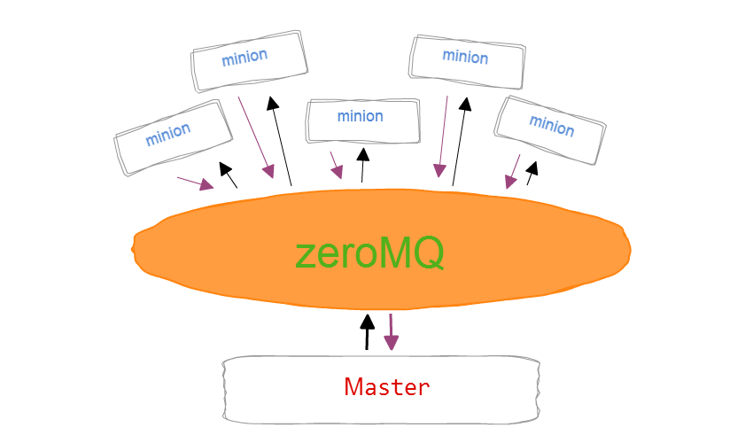

# SaltStack简介
SaltStack是基于Python开发的一套C/S架构配置管理工具（功能不仅仅是配置管理，如使用salt-cloud配置AWS EC2实例），它的底层使用ZeroMQ消息队列pub/sub方式通信，使用SSL证书签发的方式进行认证管理。

号称世界上最快的消息队列ZeroMQ使得SaltStack能快速在成千上万台机器上进行各种操作，而且采用RSA Key方式确认身份，传输采用AES加密，这使得它的安全性得到了保障。

SaltStack经常被描述为Func加强版+Puppet精简版。

## 为什么选择SaltStack？
目前市场上主流的开源自动化配置管理工具有puppet、chef、ansible、saltstack等等。到底选择那个比较好？可以从以下几方面考虑：

语言的选择（puppet/chef vs ansible/saltstack）
Puppet、Chef基于Ruby开发，ansible、saltstack基于python开发的

运维开发语言热衷于python（后期可做二次开发），排除Puppet、Chef

速度的选择 (ansible vs saltstack)
ansible基于ssh协议传输数据，SaltStack使用消息队列zeroMQ传输数据。从网上数据来看，SaltStack比ansible快大约40倍。

对比ansible，Saltstack缺点是需要安装客户端。为了速度建议选择SaltStack

SaltStack github地址：https://github.com/saltstack/salt

SaltStack官网文档地址：https://docs.saltstack.com

## saltstack架构
在SaltsStack架构中服务端叫作Master，客户端叫作Minion，都是以守护进程的模式运行，一直监听配置文件中定义的ret_port（saltstack客户端与服务端通信的端口，负责接收客户端发送过来的结果，默认4506端口）和publish_port（saltstack的消息发布系统，默认4505端口）的端口。当Minion运行时会自动连接到配置文件中定义的Master地址ret_port端口进行连接认证。

1. Master：控制中心,salt命令运行和资源状态管理
2. Minion : 需要管理的客户端机器,会主动去连接Mater端,并从Master端得到资源状态
3. 信息,同步资源管理信息
4. States：配置管理的指令集
5. Modules：在命令行中和配置文件中使用的指令模块,可以在命令行中运行
6. Grains：minion端的变量,静态的
7. Pillar：minion端的变量,动态的比较私密的变量,可以通过配置文件实现同步minions定义
8. highstate：为minion端下发永久添加状态,从sls配置文件读取.即同步状态配置
9. salt_schedule：会自动保持客户端配置

## SaltStack安装配置
以mac, ubuntu为例
- mac 
```bash
$ pip3 install salt
```
- ubuntu(推荐在linux master空值其他server)
```bash
# master端
$ apt-get install salt-api salt-cloud salt-master salt-minion salt-ssh salt-syndic python-setproctitle
# minion端
$ apt-get install salt-api salt-cloud salt-minion salt-ssh salt-syndic python-setproctitle
```
- master端配置
```bash
$ vim /etc/salt/master
# 修改interface监听地址为本机ip
interface: 0.0.0.0
user: root
# 修改auto_accept 自动接收minion的key
auto_accept: True
# 指定发布端口
publish_port: 4505
# 指定结果返回端⼝,  与minion配置⽂件中的master_port对应(默认为4506)
ret_port: 4506
```
```bash
# 查看master的主密钥指纹
$ salt-key -F master
```
- minion端配置
    - minion端至少需要配置两项，id和master需要指定。
        - id: 这台主机的唯一标识！ 就像mac地址一样！
        - master: 指定salt master的IP地址或域名!
        
注意：注意冒号后面一定要有一个空格。
```bash
$ vim /etc/salt/minion
id: node1.salt.com
master: 192.168.56.111 (修改master为master的IP地址)
master_port: 4506
```
```bash
# 查看minion的密钥指纹
$ salt-call --local key.finger
```

## 服务启动与关闭
- 查看服务状态
```bash
$ service salt-master status 
```
```bash
# master
$ service salt-master start
$ service salt-master stop

# minion
$ service salt-minion start
$ service salt-minion stop

# 配置开机启动
$ chkconfig salt-master on
$ chkconfig salt-minion on

# 遇到错误
$ chkconfig
command not found: chkconfig   //chkconfig 已弃用
# 建议使用 sysv-rc-conf 
$ apt-get install sysv-rc-conf

$ sysv-rc-conf salt-master on
$ sysv-rc-conf salt-minion on
# 关闭 off
```

## Master与Minion通信
SaltStack master启动后默认监听4505和4506两个端口。4505(publish_port) 为saltstack的消息发布系统，4506 (ret_port) 为saltstack客户端与服务端通信的端口。如果使用lsof查看4505端口，会发现所有的minion在4505端口持续保持在ESTABLISHED状态。
```bash
[root@m01 ~]# lsof -i :4505
COMMAND     PID USER   FD   TYPE DEVICE SIZE/OFF NODE NAME
salt-mini 27600 root   24u  IPv4 288107      0t0  TCP linux-node1.example.com:58100->linux-node1.example.com:4505 (ESTABLISHED)
salt-mast 29470 root   12u  IPv4 286742      0t0  TCP *:4505 (LISTEN)
salt-mast 29470 root   14u  IPv4 286810      0t0  TCP linux-node1.example.com:4505->linux-node2.example.com:31465 (ESTABLISHED)
salt-mast 29470 root   15u  IPv4 288108      0t0  TCP linux-node1.example.com:4505->linux-node1.example.com:58100 (ESTABLISHED)
[root@web01 ~]# lsof -i :4506
COMMAND     PID USER   FD   TYPE DEVICE SIZE/OFF NODE NAME
salt-mini 27600 root   13u  IPv4 286775      0t0  TCP linux-node1.example.com:47906->linux-node1.example.com:4506 (ESTABLISHED)
salt-mast 29490 root   20u  IPv4 286771      0t0  TCP *:4506 (LISTEN)
salt-mast 29490 root   22u  IPv4 286776      0t0  TCP linux-node1.example.com:4506->linux-node1.example.com:47906 (ESTABLISHED)
salt-mast 29490 root   23u  IPv4 286777      0t0  TCP linux-node1.example.com:4506->linux-node2.example.com:40763 (ESTABLISHED)
```

## master与minion的认证
minion在第一次启动时，会在/etc/salt/pki/minion/（该路径在/etc/salt/minion里面设置）下自动生成minion.pem（private key）和 minion.pub（public key），然后将 minion.pub发送给master。master在接收到minion的public key后，通过salt-key命令accept minion public key，这样在master的/etc/salt/pki/master/minions下的将会存放以minion id命名的 public key，然后master就能对minion发送指令了。

master
```bash
$ salt-key -L #查看所有主机当前证书签证情况
# 没有接受的key会显示在Unaccepted Keys下
$ salt-key -A #接受所有主机
$ salt-key -D #删除所有主机
$ salt-key -a node1.salt.com  #接受指定的主机
$ salt-key -d node1.salt.com  #删除指定的主机
```

## 测试连通性
master
```bash
$ salt '*' test.ping
node1.salt.com:
    True
```