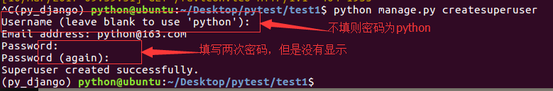
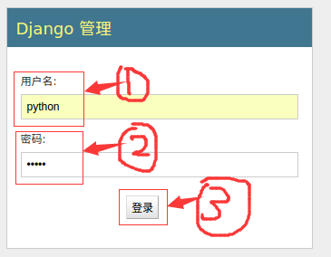
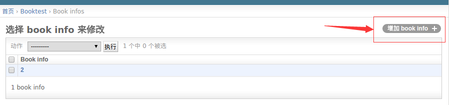
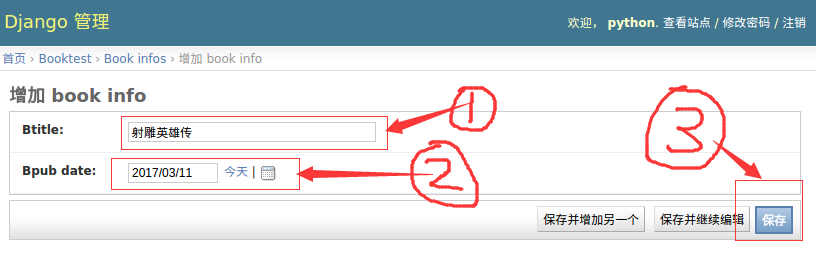
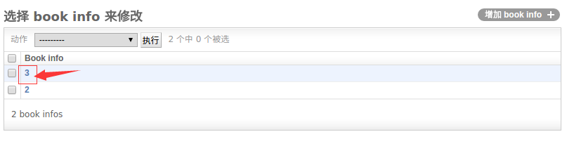
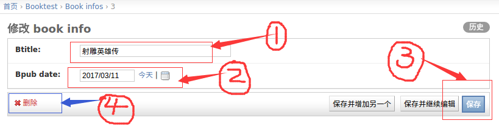

## 后台管理
- 站点分为内容发布和公共访问两部分
- 内容发布的部分由网站的管理员负责查看、添加、修改、删除数据，开发这些重复的功能是一件单调乏味、缺乏创造力的工作，为此，Django能够根据定义的模型类自动地生成管理模块
- 使用Django的管理模块，需要按照如下步骤操作
    - 1.管理界面本地化
    - 2.创建管理员
    - 3.注册模型类
    - 4.自定义管理页面

### 1.管理界面本地化
- 本地化是将显示的语言、时间等使用本地的习惯，这里的本地化就是进行中国化，中国大陆地区使用简体中文，时区使用亚洲/上海时区，注意这里不使用北京时区表示
- 打开test1/settings.py文件，找到语言编码、时区的设置项，将内容改为如下
```
LANGUAGE_CODE = 'zh-Hans'
TIME_ZONE = 'Asia/Shanghai'
```

### 2.创建管理员
- 创建管理员的代码如下，按提示输入用户名、邮箱、密码
```
python manage.py createsuperuser
```

- 启动服务器
```
python manage.py runserver
```

- 打开浏览器，在地址栏中输入如下地址后回车
```
http://127.0.0.1:8000/admin
```

- 登录成功后界面如下，但是并没有图书、英雄的管理入口，接下来进行第三步操作


### 3.注册模型类
- 登录后台管理后，默认没有我们创建的应用中定义的模型类，需要在自己应用中的admin.py文件中注册，才可以在后台管理中看到，并进行crud操作
- 打开booktest/admin.py文件，编写如下代码
```
from django.contrib import admin
from models import BookInfo,HeroInfo

admin.site.register(BookInfo)
admin.site.register(HeroInfo)
```
- 到浏览器中刷新页面，可以看到模型类BookInfo和HeroInfo的管理了

- 点击类名称“BookInfo”可以进入列表页，默认只有一列，显示的是str方法返回的值

- 在列表页中点击“增加”可以进入增加页，Django会根据模型类的不同，生成不同的表单控件，按提示填写表单内容后点击"保存"，完成数据创建，创建成功后返回列表页

- 在列表页中点击某行的第一列可以进入修改页

- 按照提示进行内容的修改，修改成功后进入列表页
- 在修改页点击“删除”可以删除一项

- 删除：在列表页勾选想要删除的复选框，可以删除多项
- 点击执行后进入确认页面，删除后回来列表页面
- 数据都删除了，接下来手动造一些数据出来

### 4.自定义管理页面
- 在列表页只列出了str方法的返回值，对象的其它属性并没有列出来，查看非常不方便
- Django提供了自定义管理页面的功能，比如列表页要显示哪些值
- 打开booktest/admin.py文件，自定义类，继承自admin.ModelAdmin类
- 属性list_display表示要显示哪些属性
```python
class BookInfoAdmin(admin.ModelAdmin):
    list_display = ['pk', 'btitle', 'bpub_date']
```
- 修改模型类BookInfo的注册代码如下
```python
admin.site.register(BookInfo, BookInfoAdmin)
```
- 刷新BookInfo的列表页，所有属性都显示出来了
- 最终booktest/admin.py文件代码如下
```python
from django.contrib import admin
from models import BookInfo,HeroInfo

class BookInfoAdmin(admin.ModelAdmin):
    list_display = ['pk', 'btitle', 'bpub_date']
class HeroInfoAdmin(admin.ModelAdmin):
    list_display = ['pk', 'hname','hgender','hcontent']

admin.site.register(BookInfo,BookInfoAdmin)
admin.site.register(HeroInfo,HeroInfoAdmin)
```
