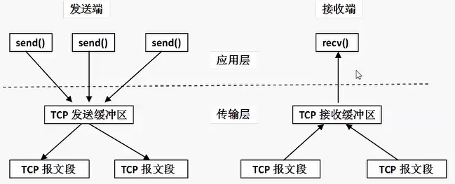
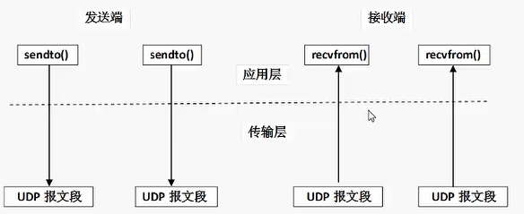

## tcp介绍
TCP协议，传输控制协议（英语：Transmission Control Protocol，缩写为 TCP）是一种面向连接的、可靠的、基于字节流的传输层通信协议，由IETF的RFC 793定义。

tcp通信需要经过创建连接、数据传送、终止连接三个步骤。

tcp通信模型中，在通信开始之前，一定要先建立相关的链接，才能发送数据，类似于生活中，"打电话""

## TCP特点
#### 1. 面向连接
通信双方必须先建立连接才能进行数据的传输，双方都必须为该连接分配必要的系统内核资源，以管理连接的状态和连接上的传输。

双方间的数据传输都可以通过这一个连接进行。

完成数据交换后，双方必须断开此连接，以释放系统资源。

这种连接是一对一的，不适用于广播的应用程序，基于广播的应用程序适合使用UDP协议。

#### 2. 基于数据流（字节流）
1）tcp数据流

发送端执行多次写操作（send）时，TCP模块先把这些数据放入TCP发送缓冲区中，当TCP模块真正可以发送数据时，才把TCP发送缓冲区等待发送的数据封装成一个或多个TCP报文段发出。

TCP会把数据流切分成一个或多个适当长度的报文段（通常受该计算机连接的网络的数据链路层的最大传输单元（MTU）的限制）。
```
TCP模块发出的报文的个数与应用程序的写操作（send）的次数没有固定的数量关系。
```
接收端收到报文段后，TCP模块把它们携带的应用数据按照TCP报文段的序号依次放入TCP接收缓冲区中，同时通知应用程序读取数据，接收端应用程序可以一次或多次读取数据（取决于用户指定的应用程序读缓冲区大小）
```
应用程序执行读操作的次数和TCP模块接收到的TCP报文的个数没有固定的数量关系。

发送端执行的写操作（send）次数与接收端执行的读操作（recv）次数没有数量对应关系。
```


2）对比udp数据报

UDP发送端执行一次写操作（sendto)，UDP模块把它封装成一个UDP数据报并发送。

接收端针对每一个数据报执行读操作（recvfrom），否则就会发生丢包，并且如果用户没有指定足够的应用程序缓冲区来读取数据报，则UDP数据报就会被截断（接收不完整）。


#### 3. 可靠传输
1）TCP采用发送应答机制

TCP发送的每个报文段都必须得到接收方的应答才认为这个TCP报文段传输成功

2）超时重传

发送端发出一个报文段之后就启动定时器，如果在定时时间内没有收到应答就重新发送这个报文段。

TCP为了保证不发生丢包，就给每个包一个序号，同时序号也保证了传送到接收端实体的包的按序接收。然后接收端实体对已成功收到的包发回一个相应的确认（ACK）；如果发送端实体在合理的往返时延（RTT）内未收到确认，那么对应的数据包就被假设为已丢失将会被进行重传。

3）错误校验

TCP用一个校验和函数来检验数据是否有错误；在发送和接收时都要计算校验和。

4） 流量控制和阻塞管理

流量控制用来避免主机发送得过快而使接收方来不及完全收下。

## TCP与UDP的不同点
- 面向连接（确认有创建三方交握，连接已创建才作传输。）
- 有序数据传输
- 重发丢失的数据包
- 舍弃重复的数据包
- 无差错的数据传输
- 阻塞/流量控制

