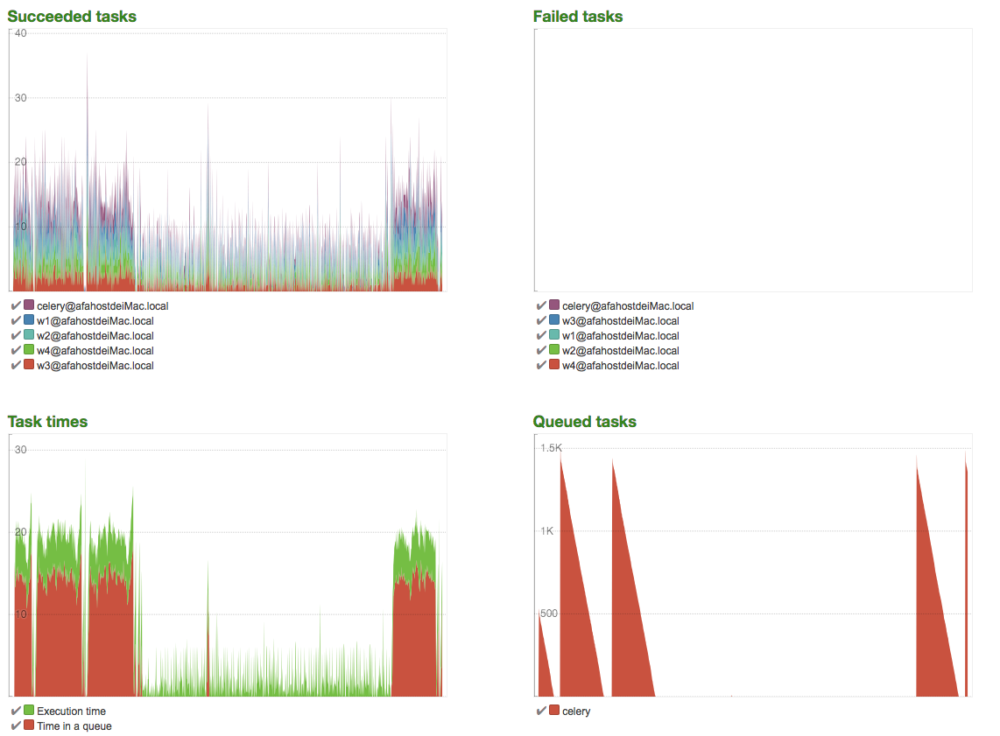

# fz_ip_pool
*分布式并发代理ip池*

旨在: 获取真实高匿可复用的免费proxy ip

## 架构
celery + redis + httpbin + spiders

## 依赖安装
```bash
$ pip3 install fzutils
```

## 本地安装proxy ip检测环境
- 安装前提: 机器的80端口对快开放(否则无需设置, 跳过)
```bash
# pull
$ docker pull kennethreitz/httpbin 
# 启动
$ docker run -p 80:80 kennethreitz/httpbin
# 修改settings.py
TEST_HTTP_HEADER = 'http://0.0.0.0:80/get'
# TEST_HTTP_HEADER = 'http://httpbin.org/get'
```

## ip_pools启动
#### 1. redis
- 安装redis
```bash
# mac
$ brew install redis
```
- 启动redis
```bash
# server
$ redis-server

# cli客户端
$ redis-cli 
```

#### 2. 运行proxy_spiders_tasks worker
- 单一worker
```bash
# info
$ celery -A proxy_tasks worker -l info
# debug
celery -A proxy_tasks worker -l debug
```
- worker多开(推荐)
```bash
celery multi start w1 -A proxy_tasks 
celery multi start w2 -A proxy_tasks 
celery multi start w3 -A proxy_tasks 
celery multi start w4 -A proxy_tasks 
celery multi start w5 -A proxy_tasks 
```
*开5个worker的网络并发状态*


#### 3. python3 main.py

## API demo
eg: api.py's IpPoolsObj class

## tasks状态监控
```bash
$ pip3 install flower
```
- 启动
```bash
$ celery -A proxy_tasks flower --address=127.0.0.1 --port=5555
$ open http://localhost:5555
```



