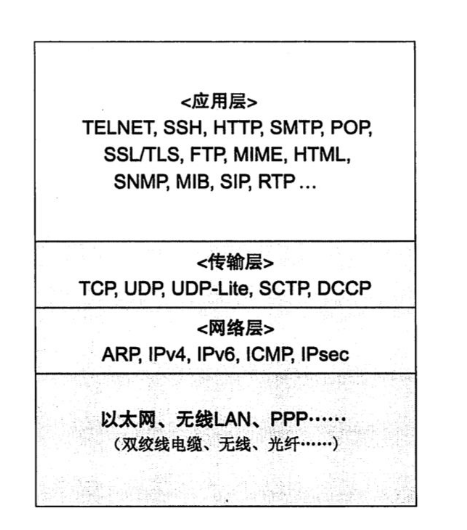
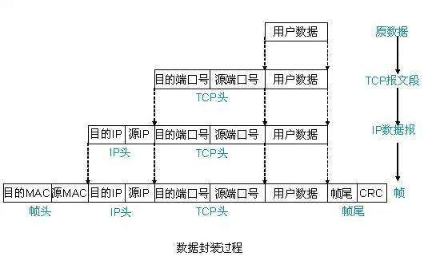

# scapy(资深爬虫工程师必备)
Scapy是一个功能强大的基于Python的交互式数据包操作程序和库。

它能够伪造或解码大量协议的数据包，通过线路发送，捕获它们，使用pcap文件存储或读取它们，匹配请求和回复等等。它旨在通过使用有效的默认值来实现快速数据包原型设计。

它可以很容易地处理像扫描，tracerouting，探测，单元测试，攻击或网络发现最经典的任务（它可以取代hping，85％ ，nmap， arpspoof，arp-sk，arping，tcpdump，wireshark，p0f等）。它在许多其他工具无法处理的许多其他特定任务中也表现良好，例如发送无效帧，注入自己的802.11帧，组合技术（VLAN跳跃+ ARP缓存中毒，WEP保护通道上的VoIP解码，等等）。 ..）等

[官网地址](https://github.com/secdev/scapy)
[官方教程](https://scapy.readthedocs.io/en/latest/usage.html#starting-scapy)
[BPF语法](https://community.dynatrace.com/community/display/DCRUM124/Filter+error+messages+and+syntax)

## 数据包结构
tcp/ip五层分层结构



数据分装过程



## 使用

### 交互式shell用法
Scapy可以很容易地用作交互式shell来与网络进行交互。以下示例显示如何向其发送ICMP Echo Request消息 github.com，然后显示应答源IP地址：
```python
sudo ./run_scapy 
Welcome to Scapy
>>> p = IP(dst="github.com")/ICMP()
>>> r = sr1(p)
Begin emission:
.Finished to send 1 packets.
*
Received 2 packets, got 1 answers, remaining 0 packets
>>> r[IP].src
'192.30.253.113'
```

### scapy包
```python
# 例如检查是否打开了TCP端口, 保存为send_tcp_syn.py
from scapy.all import *
conf.verb = 0

p = IP(dst="github.com")/TCP()
r = sr1(p)
print(r.summary())

# 然后运行脚本
$ sudo python send_tcp_syn.py
IP / TCP 192.30.253.113:http > 192.168.46.10:ftp_data SA / Padding
```

### 使用scapy抓包
使用 scapy 抓包的 sniff 方法即可抓包，下面先来看下 sniff 方法的描述信息：
```python
def sniff(count=0, store=1, offline=None, prn=None, lfilter=None,  
          L2socket=None, timeout=None, opened_socket=None,
          stop_filter=None, iface=None, *arg, **karg):
    """Sniff packets
sniff([count=0,] [prn=None,] [store=1,] [offline=None,]  
[lfilter=None,] + L2ListenSocket args) -> list of packets
  count: number of packets to capture. 0 means infinity
  store: wether to store sniffed packets or discard them
    prn: function to apply to each packet. If something is returned,
         it is displayed. Ex:
         ex: prn = lambda x: x.summary()
lfilter: python function applied to each packet to determine  
         if further action may be done
         ex: lfilter = lambda x: x.haslayer(Padding)
offline: pcap file to read packets from, instead of sniffing them  
timeout: stop sniffing after a given time (default: None)  
L2socket: use the provided L2socket  
opened_socket: provide an object ready to use .recv() on  
stop_filter: python function applied to each packet to determine  
             if we have to stop the capture after this packet
             ex: stop_filter = lambda x: x.haslayer(TCP)
iface: interface or list of interfaces (default: None for sniffing on all  
interfaces)  
    """
```
- count：抓包的数量，0表示无限制；
- store：保存抓取的数据包或者丢弃；
- prn：为每一个数据包定义一个函数，如果返回了什么，则显示。例如：prn = lambda x: x.summary()；
- offline：从 pcap 文件读取数据包，而不进行嗅探；
- timeout：在给定的时间后停止嗅探，默认为 None；
- L2socket：使用给定的 L2socket；
- opened_socket：对指定的对象使用 .recv() 进行读取；
- stop_filter：定义一个函数，决定在抓到指定数据包后停止抓包，如：stop_filter = lambda x: x.haslayer(TCP)；
- iface：指定抓包的接口

#### scapy强大地方之一在于可以通过字段来查看每一个字段信息
- ls(TCP)
- ls(ARP)
- ls(UDP)
- ls(Ether)

#### 列出scapy中可以使用的命令或函数
- lsc()

#### scapy配置选项
- conf

#### 指定数据包的详细信息
- show()

#### 输出某一层某个参数的取值
- sprintf()
    - 具体的format格式是:%[[fmt][r],][layer[:nb].]field%
        - layer:协议层的名字，如Ether、IP、Dot11、TCP等。
        - filed:需要显示的参数。
        - nb:当有两个协议层有相同的参数名时，nb用于到达你想要的协议层。
        - r:是一个标志。当使用r标志时，意味着显示的是参数的原始值。例如，TCP标志中使用人类可阅读的字符串’SA’表示SYN和ACK标志，而其原始值是18.

#### 帧与字符串的互相转换
```bash
>>> icmp_str = str(pkts[0])
>>> icmp_str
"@l\x8f.\xd5\xc4\x08\x00'5BY\x08\x00E\x00\x00d\xc3\xdd@\x00@\x06\xf2\xf8\xc0\xa8\x01\x0e\xc0\xa8\x01_\x00\x16\xf0u\xe3\xa3;\x04\xa9`\nS\x80\x18\x13\xcc\x84\x14\x00\x00\x01\x01\x08\n\x0c\x0b+\xa9J\xe5\x14\xccz\x19\x82\xbd\\$\xc7Y\x1c\x1c\xf0\xb5a\x9e\xa3\x0b7\x0c\xf0\xcb\xa1@\x86,\xd8\xc5yJ_Q\xaaQ\xf5\x98\xd5<_q\x15B\xab\xceE\xa8&\x9d\x0b\x95"
>>> recombine = Ether(icmp_str)
>>> recombine
<Ether  dst=40:6c:8f:2e:d5:c4 src=08:00:27:35:42:59 type=0x800 |<IP  version=4L ihl=5L tos=0x0 len=100 id=50141 flags=DF frag=0L ttl=64 proto=tcp chksum=0xf2f8 src=192.168.1.14 dst=192.168.1.95 options=[] |<TCP  sport=ssh dport=61557 seq=3819125508L ack=2841643603L dataofs=8L reserved=0L flags=PA window=5068 chksum=0x8414 urgptr=0 options=[('NOP', None), ('NOP', None), ('Timestamp', (202058665, 1256527052))] |<Raw  load='z\x19\x82\xbd\\$\xc7Y\x1c\x1c\xf0\xb5a\x9e\xa3\x0b7\x0c\xf0\xcb\xa1@\x86,\xd8\xc5yJ_Q\xaaQ\xf5\x98\xd5<_q\x15B\xab\xceE\xa8&\x9d\x0b\x95' |>>>>
```

#### 导入导出base64编码格式的数据
```bash
>>> export_object(str(pkts[0]))
eNoBeQCG/4ACVXJAbI8u1cQIACc1QlkIAEUAAGTD3UAAQAby+MCoAQ7AqAFfABbwdeOjOwSpYApT
gBgTzIQUAAABAQgKDAsrqUrlFMx6GYK9XCTHWRwc8LVhnqMLNwzwy6FAhizYxXlKX1GqUfWY1Txf
cRVCq85FqCadC5VxAS4+6i3U
>>> newPkt = import_object(_)   #将上一步导出的字符串填入，回车，"ctrl_+d"结束。
eNoBeQCG/4ACVXJAbI8u1cQIACc1QlkIAEUAAGTD3UAAQAby+MCoAQ7AqAFfABbwdeOjOwSpYApT
gBgTzIQUAAABAQgKDAsrqUrlFMx6GYK9XCTHWRwc8LVhnqMLNwzwy6FAhizYxXlKX1GqUfWY1Txf
cRVCq85FqCadC5VxAS4+6i3U
>>> newPkt
"@l\x8f.\xd5\xc4\x08\x00'5BY\x08\x00E\x00\x00d\xc3\xdd@\x00@\x06\xf2\xf8\xc0\xa8\x01\x0e\xc0\xa8\x01_\x00\x16\xf0u\xe3\xa3;\x04\xa9`\nS\x80\x18\x13\xcc\x84\x14\x00\x00\x01\x01\x08\n\x0c\x0b+\xa9J\xe5\x14\xccz\x19\x82\xbd\\$\xc7Y\x1c\x1c\xf0\xb5a\x9e\xa3\x0b7\x0c\xf0\xcb\xa1@\x86,\xd8\xc5yJ_Q\xaaQ\xf5\x98\xd5<_q\x15B\xab\xceE\xa8&\x9d\x0b\x95"
>>> Ether(newPkt)
<Ether  dst=40:6c:8f:2e:d5:c4 src=08:00:27:35:42:59 type=0x800 |<IP  version=4L ihl=5L tos=0x0 len=100 id=50141 flags=DF frag=0L ttl=64 proto=tcp chksum=0xf2f8 src=192.168.1.14 dst=192.168.1.95 options=[] |<TCP  sport=ssh dport=61557 seq=3819125508L ack=2841643603L dataofs=8L reserved=0L flags=PA window=5068 chksum=0x8414 urgptr=0 options=[('NOP', None), ('NOP', None), ('Timestamp', (202058665, 1256527052))] |<Raw  load='z\x19\x82\xbd\\$\xc7Y\x1c\x1c\xf0\xb5a\x9e\xa3\x0b7\x0c\xf0\xcb\xa1@\x86,\xd8\xc5yJ_Q\xaaQ\xf5\x98\xd5<_q\x15B\xab\xceE\xa8&\x9d\x0b\x95' |>>>>
```

### scapy-http
scapy-http 直接将 数据包格式化成 http数据信息，免去自己构建http数据结构进行解析的麻烦

### 图形转储（PDF，PS）
如果您已经安装PyX，您可以做一个数据包的图形PostScript/ PDF转储（见下面丑陋的PNG图像，PostScript/PDF则具有更好的质量...）
```bash
>>> a[423].pdfdump(layer_shift=1)
>>> a[423].psdump("/tmp/isakmp_pkt.eps",layer_shift=1)
```
```bash
命令      效果
str(pkt) 	组装数据包
hexdump(pkt) 	十六进制转储
ls(pkt) 	显示出字段值的列表
pkt.summary() 	一行摘要
pkt.show() 	针对数据包的展开试图
pkt.show2() 	显示聚合的数据包（例如，计算好了校验和）
pkt.sprintf() 	用数据包字段填充格式字符串
pkt.decode_payload_as() 	改变payload的decode方式
pkt.psdump() 	绘制一个解释说明的PostScript图表
pkt.pdfdump() 	绘制一个解释说明的PDF
pkt.command() 	返回可以生成数据包的Scapy命令
```

### 进制打印
Scapy允许您以各种十六进制格式导出记录的数据包

用于hexdump()使用经典hexdump格式显示一个或多个数据包：
```bash
>>> hexdump(pkt)
0000   00 50 56 FC CE 50 00 0C  29 2B 53 19 08 00 45 00   .PV..P..)+S...E.
0010   00 54 00 00 40 00 40 01  5A 7C C0 A8 19 82 04 02   .T..@.@.Z|......
0020   02 01 08 00 9C 90 5A 61  00 01 E6 DA 70 49 B6 E5   ......Za....pI..
0030   08 00 08 09 0A 0B 0C 0D  0E 0F 10 11 12 13 14 15   ................
0040   16 17 18 19 1A 1B 1C 1D  1E 1F 20 21 22 23 24 25   .......... !"#$%
0050   26 27 28 29 2A 2B 2C 2D  2E 2F 30 31 32 33 34 35   &'()*+,-./012345
0060   36 37                                              67
```
上面的Hexdump可以使用以下方法重新导入Scapy import_hexcap()：
```bash
>>> pkt_hex = Ether(import_hexcap())
0000   00 50 56 FC CE 50 00 0C  29 2B 53 19 08 00 45 00   .PV..P..)+S...E.
0010   00 54 00 00 40 00 40 01  5A 7C C0 A8 19 82 04 02   .T..@.@.Z|......
0020   02 01 08 00 9C 90 5A 61  00 01 E6 DA 70 49 B6 E5   ......Za....pI..
0030   08 00 08 09 0A 0B 0C 0D  0E 0F 10 11 12 13 14 15   ................
0040   16 17 18 19 1A 1B 1C 1D  1E 1F 20 21 22 23 24 25   .......... !"#$%
0050   26 27 28 29 2A 2B 2C 2D  2E 2F 30 31 32 33 34 35   &'()*+,-./012345
0060   36 37                                              67
>>> pkt_hex
<Ether  dst=00:50:56:fc:ce:50 src=00:0c:29:2b:53:19 type=0x800 |<IP  version=4L
ihl=5L tos=0x0 len=84 id=0 flags=DF frag=0L ttl=64 proto=icmp chksum=0x5a7c
src=192.168.25.130 dst=4.2.2.1 options='' |<ICMP  type=echo-request code=0
chksum=0x9c90 id=0x5a61 seq=0x1 |<Raw  load='\xe6\xdapI\xb6\xe5\x08\x00\x08\t\n
\x0b\x0c\r\x0e\x0f\x10\x11\x12\x13\x14\x15\x16\x17\x18\x19\x1a\x1b\x1c\x1d\x1e
\x1f !"#$%&\'()*+,-./01234567' |>>>>
```

### 二进制字符串
还可以使用以下raw()函数将整个数据包转换为二进制字符串：
```bash
>>> pkts = sniff(count = 1)
>>> pkt = pkts[0]
>>> pkt
<Ether  dst=00:50:56:fc:ce:50 src=00:0c:29:2b:53:19 type=0x800 |<IP  version=4L
ihl=5L tos=0x0 len=84 id=0 flags=DF frag=0L ttl=64 proto=icmp chksum=0x5a7c
src=192.168.25.130 dst=4.2.2.1 options='' |<ICMP  type=echo-request code=0
chksum=0x9c90 id=0x5a61 seq=0x1 |<Raw  load='\xe6\xdapI\xb6\xe5\x08\x00\x08\t\n
\x0b\x0c\r\x0e\x0f\x10\x11\x12\x13\x14\x15\x16\x17\x18\x19\x1a\x1b\x1c\x1d\x1e
\x1f !"#$%&\'()*+,-./01234567' |>>>>
>>> pkt_raw = raw(pkt)
>>> pkt_raw
'\x00PV\xfc\xceP\x00\x0c)+S\x19\x08\x00E\x00\x00T\x00\x00@\x00@\x01Z|\xc0\xa8
\x19\x82\x04\x02\x02\x01\x08\x00\x9c\x90Za\x00\x01\xe6\xdapI\xb6\xe5\x08\x00
\x08\t\n\x0b\x0c\r\x0e\x0f\x10\x11\x12\x13\x14\x15\x16\x17\x18\x19\x1a\x1b
\x1c\x1d\x1e\x1f !"#$%&\'()*+,-./01234567'
```
我们可以通过选择适当的第一层（例如Ether()）来重新导入生成的二进制字符串。
```bash
>>> new_pkt = Ether(pkt_raw)
>>> new_pkt
<Ether  dst=00:50:56:fc:ce:50 src=00:0c:29:2b:53:19 type=0x800 |<IP  version=4L
ihl=5L tos=0x0 len=84 id=0 flags=DF frag=0L ttl=64 proto=icmp chksum=0x5a7c
src=192.168.25.130 dst=4.2.2.1 options='' |<ICMP  type=echo-request code=0
chksum=0x9c90 id=0x5a61 seq=0x1 |<Raw  load='\xe6\xdapI\xb6\xe5\x08\x00\x08\t\n
\x0b\x0c\r\x0e\x0f\x10\x11\x12\x13\x14\x15\x16\x17\x18\x19\x1a\x1b\x1c\x1d\x1e
\x1f !"#$%&\'()*+,-./01234567' |>>>>
```

### Base64编码
使用该export_object()函数，Scapy可以导出表示数据包的base64编码的Python数据结构：
```bash
>>> pkt
<Ether  dst=00:50:56:fc:ce:50 src=00:0c:29:2b:53:19 type=0x800 |<IP  version=4L
ihl=5L tos=0x0 len=84 id=0 flags=DF frag=0L ttl=64 proto=icmp chksum=0x5a7c
src=192.168.25.130 dst=4.2.2.1 options='' |<ICMP  type=echo-request code=0
chksum=0x9c90 id=0x5a61 seq=0x1 |<Raw  load='\xe6\xdapI\xb6\xe5\x08\x00\x08\t\n
\x0b\x0c\r\x0e\x0f\x10\x11\x12\x13\x14\x15\x16\x17\x18\x19\x1a\x1b\x1c\x1d\x1e\x1f
!"#$%&\'()*+,-./01234567' |>>>>
>>> export_object(pkt)
eNplVwd4FNcRPt2dTqdTQ0JUUYwN+CgS0gkJONFEs5WxFDB+CdiI8+pupVl0d7uzRUiYtcEGG4ST
OD1OnB6nN6c4cXrvwQmk2U5xA9tgO70XMm+1rA78qdzbfTP/lDfzz7tD4WwmU1C0YiaT2Gqjaiao
bMlhCrsUSYrYoKbmcxZFXSpPiohlZikm6ltb063ZdGpNOjWQ7mhPt62hChHJWTbFvb0O/u1MD2bT
WZXXVCmi9pihUqI3FHdEQslriiVfWFTVT9VYpog6Q7fsjG0qRWtQNwsW1fRTrUg4xZxq5pUx1aS6
...
```
上面的输出可以使用以下方法重新导入Scapy import_object()：
```bash
>>> new_pkt = import_object()
eNplVwd4FNcRPt2dTqdTQ0JUUYwN+CgS0gkJONFEs5WxFDB+CdiI8+pupVl0d7uzRUiYtcEGG4ST
OD1OnB6nN6c4cXrvwQmk2U5xA9tgO70XMm+1rA78qdzbfTP/lDfzz7tD4WwmU1C0YiaT2Gqjaiao
bMlhCrsUSYrYoKbmcxZFXSpPiohlZikm6ltb063ZdGpNOjWQ7mhPt62hChHJWTbFvb0O/u1MD2bT
WZXXVCmi9pihUqI3FHdEQslriiVfWFTVT9VYpog6Q7fsjG0qRWtQNwsW1fRTrUg4xZxq5pUx1aS6
...
>>> new_pkt
<Ether  dst=00:50:56:fc:ce:50 src=00:0c:29:2b:53:19 type=0x800 |<IP  version=4L
ihl=5L tos=0x0 len=84 id=0 flags=DF frag=0L ttl=64 proto=icmp chksum=0x5a7c
src=192.168.25.130 dst=4.2.2.1 options='' |<ICMP  type=echo-request code=0
chksum=0x9c90 id=0x5a61 seq=0x1 |<Raw  load='\xe6\xdapI\xb6\xe5\x08\x00\x08\t\n
\x0b\x0c\r\x0e\x0f\x10\x11\x12\x13\x14\x15\x16\x17\x18\x19\x1a\x1b\x1c\x1d\x1e\x1f
!"#$%&\'()*+,-./01234567' |>>>>
```

## 固定思路
1. 初始化以太网数据包对象
2. 以太网数据包分离出ip数据包
3. IP数据包分离传输层数据包
4. 传输层数据包分离应用层数据包

只要我们具备基础的网络知识，结合程序中各个对象提供的字段就能得到我们想要的任何基础信息，在此基础上做些信息处理就能完成大部分网络监听和数据处理的任务。

如果这方面有欠缺的话，请立即去充电吧！