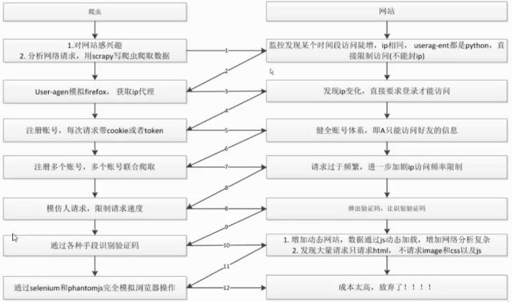

基本概念：

爬虫：

        自动获取网站数据的程序，关键是批量的获取

反爬虫：

        使用技术手段防止爬虫程序的方法

误伤：

        反爬技术将普通用户识别为爬虫，如果误伤过高，效果再好也不能用

        误伤呢，意思就是，比如网吧或者学校的IP，在内属于一个局域网，如果里面的一个人写了爬虫，被目标网站禁止了的话，那么对外的IP也就是一个或者几个，这几个IP就被禁掉了，整个学校的人都不能爬这个网站了。

        还有一个情况，一个小区内的IP 是DHCP，也就是动态分配的，有时候IP地址会变，如果这次用一个IP来爬，下一次爬的时候，换了个IP就可以爬了，但是获取到之前那个IP的用户，就无法访问了。

        所以网站中使用的一般都是禁用你一段时间的IP

成本：

        反爬虫需要认了和机器成本

拦截：

        成功拦截爬虫，一般拦截效率越高，误伤率也就越高

反爬虫的目的：

初级爬虫：

        简单暴力，不管服务器压力，容易弄挂网站

数据保护：

        对数据产权的保护

失控的爬虫：

        由于某些原因，忘记或者无法关闭的爬虫

商业竞争对手：

        防止竞争对手爬网站获取数据

爬虫与反爬虫的对抗过程：

一般最后的结果都是以爬虫的胜利而告终的！