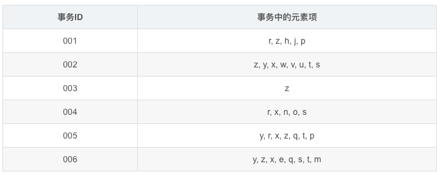

# 数据关联

## 关联分析(Apriori、FP-growth)

### 关联分析的基本概念
关联分析（Association Analysis）：在大规模数据集中寻找有趣的关系。

频繁项集（Frequent Item Sets）：经常出现在一块的物品的集合，即包含0个或者多个项的集合称为项集。

支持度（Support）：数据集中包含该项集的记录所占的比例，是针对项集来说的。

置信度（Confidence）：出现某些物品时，另外一些物品必定出现的概率，针对规则而言。

关联规则（Association Rules）：暗示两个物品之间可能存在很强的关系。形如A->B的表达式，规则A->B的度量包括支持度和置信度

项集支持度：一个项集出现的次数与数据集所有事物数的百分比称为项集的支持度

eg:support(A⇒B)=support_count(A∪B)/Neg:support(A⇒B)=support_count(A∪B)/N
支持度反映了A和B同时出现的概率，关联规则的支持度等于频繁集的支持度。

项集置信度：包含A的数据集中包含B的百分比

eg:confidence(A⇒B)=support_count(A∪B)/support_count(A)eg:confidence(A⇒B)=support_count(A∪B)/support_count(A)
置信度反映了如果交易中包含A，则交易包含B的概率。也可以称为在A发生的条件下，发生B的概率，成为条件概率。

只有支持度和置信度(可信度)较高的关联规则才是用户感兴趣的。

### 关联分析步骤
1. 发现频繁项集，即计算所有可能组合数的支持度，找出不少于人为设定的最小支持度的集合。

2. 发现关联规则，即计算不小于人为设定的最小支持度的集合的置信度，找到不小于认为设定的最小置信度规则。

### 关联分析的两种关系：简单关联关系和序列关联关系

#### 简单关联关系：
简单关联关系可以从经典的购物中进行分析，购买面包的顾客80%都会购买牛奶，由于面包和牛奶是早餐搭配的必需品，二者搭配构成了早餐的组成部分，这就是一种简单的关联关系。

#### 序列关联关系：
当购买一款新手机后，就会考虑去购买手机膜等手机配件，这就是一种序列关系，不会先买手机膜再买手机的，先后关系是非常明显的，这种关系是一种顺序性的关系，也就是一种序列关联关系。

关联规则：规则就是一种衡量事物的标准，也就是一个算法。

### 简单关联规则算法
算法思想基础

```bash
如果某个项集是频繁的，那么它的所有子集也是频繁的。更常用的是它的逆否命题，即如果一个项集是非频繁的，那么它的所有超集也是非频繁的。
```

简单关联规则是无指导的学习方法，着重探索内部结构。简单关联规则也是使用最多的技术，主要算法包括：Apriori、GRI、Carma，其中Apriori和Carma主要是如何提高关联规则的分析效率，而GRI注重如何将单一概念层次的关联推广到更多概念层次的关联，进而揭示事物内在结构。

简单关联规则的数据存储形式：一种是交易数据格式，一种是表格数据格式。

### 序列关联规则算法
序列关联规则的核心就是找到事物发展的前后关联性，研究序列关联可以来推测事物未来的发展情况，并根据预测的发展情况进行事物的分配和安排。

#### 如何设定合理的支持度和置信度？
对于某条规则：（A=a）−>（B=b）（A=a）−>（B=b）（support=30%,confident=60%）；其中support=30%表示在所有的数据记录中，同时出现A=a和B=b的概率为30%；confident=60%表示在所有的数据记录中，在出现A=a的情况下出现B=b的概率为60%，也就是条件概率。支持度揭示了A=a和B=b同时出现的概率，置信度揭示了当A=a出现时，B=b是否会一定出现的概率。

（1）如果支持度和置信度闭值设置的过高，虽然可以减少挖掘时间，但是容易造成一些隐含在数据中非频繁特征项被忽略掉，难以发现足够有用的规则；

（2）如果支持度和置信度闭值设置的过低，又有可能产生过多的规则，甚至产生大量冗余和无效的规则，同时由于算法存在的固有问题，会导致高负荷的计算量，大大增加挖掘时间。

### 关联分析的应用
(1)：购物篮分析，通过查看那些商品经常在一起出售，可以帮助商店了解用户的购物行为，这种从数据的海洋中抽取只是可以用于商品定价、市场促销、存货管理等环节

(2)：在Twitter源中发现一些公共词。对于给定的搜索词，发现推文中频繁出现的单词集合

(3)：从新闻网站点击流中挖掘新闻流行趋势，挖掘哪些新闻广泛被用户浏览到

(4)：搜索引擎推荐，在用户输入查询时推荐同时相关的查询词项

(5)：发现毒蘑菇的相似特征。这里只对包含某个特征元素（有毒素）的项集感兴趣，从中寻找毒蘑菇中的一些公共特征，利用这些特征来避免迟到哪些有毒的蘑菇

(6)：图书馆信息的书籍推荐，对于学生的借书信息，不同专业学生的借书情况，来挖掘不同学生的借书情况，进行数目的推荐。

(7)：校园网新闻通知信息的推荐，在对校园网新闻通知信息进行挖掘的过程中，分析不同部门，不同学院的新闻信息的不同，在进行新闻信息浏览的过程中进行新闻的推荐。

### Apriori算法
假设我们有一家经营着4种商品（商品0，商品1，商品2和商品3）的杂货店，2图显示了所有商品之间所有的可能组合：


对于单个项集的支持度，我们可以通过遍历每条记录并检查该记录是否包含该项集来计算。对于包含N中物品的数据集共有2N−12N−1种项集组合，重复上述计算过程是不现实的。

研究人员发现一种所谓的Apriori原理，可以帮助我们减少计算量。Apriori原理是说如果某个项集是频繁的，那么它的所有子集也是频繁的。

例如一个频繁项集包含3个项A、B、C，则这三个项组成的子集{A},{B},{C},{A、B}，{A、C}、{B、C}一定是频繁项集。

不过更常用的是它的逆否命题，即如果一个项集是非频繁的，那么它的所有超集也是非频繁的。

在图3中，已知阴影项集{2,3}是非频繁的。利用这个知识，我们就知道项集{0,2,3}，{1,2,3}以及{0,1,2,3}也是非频繁的。也就是说，一旦计算出了{2,3}的支持度，知道它是非频繁的后，就可以紧接着排除{0,2,3}、{1,2,3}和{0,1,2,3}。


Apriori算法是发现频繁项集的一种方法。并不会找出关联规则，关联规则需要在找到频繁项集以后我们再来统计。

Apriori算法的两个输入参数分别是最小支持度和数据集。该算法首先会生成所有单个元素的项集列表。接着扫描数据集来查看哪些项集满足最小支持度要求，那些不满足最小支持度的集合会被去掉。然后，对剩下来的集合进行组合以生成包含两个元素的项集。接下来，再重新扫描交易记录，去掉不满足最小支持度的项集。该过程重复进行直到所有项集都被去掉。

该算法需要不断寻找候选集，然后剪枝即去掉非频繁子集的候选集，时间复杂度由暴力枚举所有子集的指数级别O（n2）O（n2）降为多项式级别，多项式具体系数视底层实现情况而定的。

Ariori算法有两个主要步骤：

1、连接：（将项集进行两两连接形成新的候选集）

利用已经找到的kk个项的频繁项集LkLk，通过两两连接得出候选集Ck+1Ck+1，注意进行连接的Lk[i]Lk[i]，Lk[j]Lk[j]，必须有k−1个k−1个属性值相同，然后另外两个不同的分别分布在Lk[i]Lk[i]，Lk[j]Lk[j]中，这样的求出的Ck+1Ck+1为Lk+1Lk+1的候选集。

2、剪枝：（去掉非频繁项集）

候选集 Ck+1Ck+1中的并不都是频繁项集，必须剪枝去掉，越早越好以防止所处理的数据无效项越来越多。只有当子集都是频繁集的候选集才是频繁集，这是剪枝的依据。

算法实现
```python
from numpy import *


def loadDataSet():
    return [[1, 3, 4], [2, 3, 5], [1, 2, 3, 5], [2, 5]]

# 获取候选1项集，dataSet为事务集。返回一个list，每个元素都是set集合
def createC1(dataSet):
    C1 = []   # 元素个数为1的项集（非频繁项集，因为还没有同最小支持度比较）
    for transaction in dataSet:
        for item in transaction:
            if not [item] in C1:
                C1.append([item])
    C1.sort()  # 这里排序是为了，生成新的候选集时可以直接认为两个n项候选集前面的部分相同
    # 因为除了候选1项集外其他的候选n项集都是以二维列表的形式存在，所以要将候选1项集的每一个元素都转化为一个单独的集合。
    return list(map(frozenset, C1))   #map(frozenset, C1)的语义是将C1由Python列表转换为不变集合（frozenset，Python中的数据结构）


# 找出候选集中的频繁项集
# dataSet为全部数据集，Ck为大小为k（包含k个元素）的候选项集，minSupport为设定的最小支持度
def scanD(dataSet, Ck, minSupport):
    ssCnt = {}   # 记录每个候选项的个数
    for tid in dataSet:
        for can in Ck:
            if can.issubset(tid):
                ssCnt[can] = ssCnt.get(can, 0) + 1   # 计算每一个项集出现的频率
    numItems = float(len(dataSet))
    retList = []
    supportData = {}
    for key in ssCnt:
        support = ssCnt[key] / numItems
        if support >= minSupport:
            retList.insert(0, key)  #将频繁项集插入返回列表的首部
        supportData[key] = support
    return retList, supportData   #retList为在Ck中找出的频繁项集（支持度大于minSupport的），supportData记录各频繁项集的支持度


# 通过频繁项集列表Lk和项集个数k生成候选项集C(k+1)。
def aprioriGen(Lk, k):
    retList = []
    lenLk = len(Lk)
    for i in range(lenLk):
        for j in range(i + 1, lenLk):
            # 前k-1项相同时，才将两个集合合并，合并后才能生成k+1项
            L1 = list(Lk[i])[:k-2]; L2 = list(Lk[j])[:k-2]   # 取出两个集合的前k-1个元素
            L1.sort(); L2.sort()
            if L1 == L2:
                retList.append(Lk[i] | Lk[j])
    return retList

# 获取事务集中的所有的频繁项集
# Ck表示项数为k的候选项集，最初的C1通过createC1()函数生成。Lk表示项数为k的频繁项集，supK为其支持度，Lk和supK由scanD()函数通过Ck计算而来。
def apriori(dataSet, minSupport=0.5):
    C1 = createC1(dataSet)  # 从事务集中获取候选1项集
    D = list(map(set, dataSet))  # 将事务集的每个元素转化为集合
    L1, supportData = scanD(D, C1, minSupport)  # 获取频繁1项集和对应的支持度
    L = [L1]  # L用来存储所有的频繁项集
    k = 2
    while (len(L[k-2]) > 0): # 一直迭代到项集数目过大而在事务集中不存在这种n项集
        Ck = aprioriGen(L[k-2], k)   # 根据频繁项集生成新的候选项集。Ck表示项数为k的候选项集
        Lk, supK = scanD(D, Ck, minSupport)  # Lk表示项数为k的频繁项集，supK为其支持度
        L.append(Lk);supportData.update(supK)  # 添加新频繁项集和他们的支持度
        k += 1
    return L, supportData


if __name__=='__main__':
    dataSet = loadDataSet()  # 获取事务集。每个元素都是列表
    # C1 = createC1(dataSet)  # 获取候选1项集。每个元素都是集合
    # D = list(map(set, dataSet))  # 转化事务集的形式，每个元素都转化为集合。
    # L1, suppDat = scanD(D, C1, 0.5)
    # print(L1,suppDat)


    L, suppData = apriori(dataSet,minSupport=0.7)
    print(L,suppData)
```

### FP-growth算法来高效发现频繁项集

#### FP树：用于编码数据集的有效方式
FP-growth算法将数据存储在一种称为FP树的紧凑数据结构中。FP代表频繁模式（Frequent Pattern）。一棵FP树看上去与计算机科学中的其他树结构类似，但是它通过链接（link）来连接相似元素，被连起来的元素项可以看成一个链表。

与搜索树不同的是，一个元素项可以在一棵FP树种出现多次。FP树会存储项集的出现频率，而每个项集会以路径的方式存储在数中。 树节点上给出集合中的单个元素及其在序列中的出现次数，路径会给出该序列的出现次数。

相似项之间的链接称为节点链接（node link），用于快速发现相似项的位置。

下图给出了FP树的一个例子。

事务集


生成的FP树为


对FP树的解读：

图中，元素项z出现了5次，集合{r, z}出现了1次。于是可以得出结论：z一定是自己本身或者和其他符号一起出现了4次。集合{t, s, y, x, z}出现了2次，集合{t, r, y, x, z}出现了1次，z本身单独出现1次。就像这样，FP树的解读方式是读取某个节点开始到根节点的路径。路径上的元素构成一个频繁项集，开始节点的值表示这个项集的支持度。根据图5，我们可以快速读出项集{z}的支持度为5、项集{t, s, y, x, z}的支持度为2、项集{r, y, x, z}的支持度为1、项集{r, s, x}的支持度为1。FP树中会多次出现相同的元素项，也是因为同一个元素项会存在于多条路径，构成多个频繁项集。但是频繁项集的共享路径是会合并的，如图中的{t, s, y, x, z}和{t, r, y, x, z}

和之前一样，我们取一个最小阈值，出现次数低于最小阈值的元素项将被直接忽略。图中将最小支持度设为3，所以q和p没有在FP中出现。

FP-growth算法的工作流程如下。首先构建FP树，然后利用它来挖掘频繁项集。为构建FP树，需要对原始数据集扫描两遍。第一遍对所有元素项的出现次数进行计数。数据库的第一遍扫描用来统计出现的频率，而第二遍扫描中只考虑那些频繁元素。

FP-growth算法发现频繁项集的基本过程如下：
* 构建FP树
* 从FP树中挖掘频繁项集

##### 头指针表
FP-growth算法还需要一个称为头指针表的数据结构，其实很简单，就是用来记录各个元素项的总出现次数的数组，再附带一个指针指向FP树中该元素项的第一个节点。这样每个元素项都构成一条单链表。图示说明：


这里使用Python字典作为数据结构，来保存头指针表。以元素项名称为键，保存出现的总次数和一个指向第一个相似元素项的指针。

第一次遍历数据集会获得每个元素项的出现频率，去掉不满足最小支持度的元素项，生成这个头指针表。

##### 元素项排序
上文提到过，FP树会合并相同的频繁项集（或相同的部分）。因此为判断两个项集的相似程度需要对项集中的元素进行排序（不过原因也不仅如此，还有其它好处）。排序基于元素项的绝对出现频率（总的出现次数）来进行。在第二次遍历数据集时，会读入每个项集（读取），去掉不满足最小支持度的元素项（过滤），然后对元素进行排序（重排序）。

##### 构建FP树
在对事务记录过滤和排序之后，就可以构建FP树了。从空集开始，将过滤和重排序后的频繁项集一次添加到树中。如果树中已存在现有元素，则增加现有元素的值；如果现有元素不存在，则向树添加一个分支。对前两条事务进行添加的过程：


##### 实现流程
输入：数据集、最小值尺度
输出：FP树、头指针表

* 1、遍历数据集，统计各元素项出现次数，创建头指针表
* 2、移除头指针表中不满足最小值尺度的元素项
* 3、第二次遍历数据集，创建FP树。对每个数据集中的项集：
    * 3.1 初始化空FP树
    * 3.2 对每个项集进行过滤和重排序
    * 3.3 使用这个项集更新FP树，从FP树的根节点开始：
        * 3.3.1 如果当前项集的第一个元素项存在于FP树当前节点的子节点中，则更新这个子节点的计数值
        * 3.3.2 否则，创建新的子节点，更新头指针表
        * 3.3.3 对当前项集的其余元素项和当前元素项的对应子节点递归3.3的过程

##### 从一棵FP树种挖掘频繁项集
从FP树中抽取频繁项集的三个基本步骤如下：
* 从FP树中获得条件模式基；
* 利用条件模式基，构建一个条件FP树；
* 迭代重复步骤1步骤2，直到树包含一个元素项为止。

其中“条件模式基”是以所查找元素项为结尾的路径集合。每一条路径其实都是一条前缀路径（prefix path）。简而言之，一条前缀路径是介于所查找元素项与树根节点之间的所有内容。
例如


则每一个频繁元素项的条件模式基为：


发现规律了吗，z存在于路径{z}中，因此前缀路径为空，另添加一项该路径中z节点的计数值5构成其条件模式基；r存在于路径{r, z}、{r, y, x, z}、{r, s, x}中，分别获得前缀路径{z}、{y, x, z}、{s, x}，另添加对应路径中r节点的计数值（均为1）构成r的条件模式基；以此类推。

##### 创建条件FP树

对于每一个频繁项，都要创建一棵条件FP树。可以使用刚才发现的条件模式基作为输入数据，并通过相同的建树代码来构建这些树。例如，对于r，即以“{x, s}: 1, {z, x, y}: 1, {z}: 1”为输入，调用函数createTree()获得r的条件FP树；对于t，输入是对应的条件模式基“{z, x, y, s}: 2, {z, x, y, r}: 1”。

##### 递归查找频繁项集

有了FP树和条件FP树，我们就可以在前两步的基础上递归得查找频繁项集。

递归的过程是这样的：
输入：我们有当前数据集的FP树（inTree，headerTable）

* 1、初始化一个空列表preFix表示前缀
* 2、初始化一个空列表freqItemList接收生成的频繁项集（作为输出）
* 3、对headerTable中的每个元素basePat（按计数值由小到大），递归：
    * 3.1 记basePat + preFix为当前频繁项集newFreqSet
    * 3.2 将newFreqSet添加到freqItemList中
    * 3.3 计算t的条件FP树（myCondTree、myHead）
    * 3.4 当条件FP树不为空时，继续下一步；否则退出递归
    * 3.5 以myCondTree、myHead为新的输入，以newFreqSet为新的preFix，外加freqItemList，递归这个过程

实现代码
```python
# FP树类
class treeNode:
    def __init__(self, nameValue, numOccur, parentNode):
        self.name = nameValue  #节点元素名称，在构造时初始化为给定值
        self.count = numOccur   # 出现次数，在构造时初始化为给定值
        self.nodeLink = None   # 指向下一个相似节点的指针，默认为None
        self.parent = parentNode   # 指向父节点的指针，在构造时初始化为给定值
        self.children = {}  # 指向子节点的字典，以子节点的元素名称为键，指向子节点的指针为值，初始化为空字典

    # 增加节点的出现次数值
    def inc(self, numOccur):
        self.count += numOccur

    # 输出节点和子节点的FP树结构
    def disp(self, ind=1):
        print(' ' * ind, self.name, ' ', self.count)
        for child in self.children.values():
            child.disp(ind + 1)


# =======================================================构建FP树==================================================


# 对不是第一个出现的节点，更新头指针块。就是添加到相似元素链表的尾部
def updateHeader(nodeToTest, targetNode):
    while (nodeToTest.nodeLink != None):
        nodeToTest = nodeToTest.nodeLink
    nodeToTest.nodeLink = targetNode

# 根据一个排序过滤后的频繁项更新FP树
def updateTree(items, inTree, headerTable, count):
    if items[0] in inTree.children:
        # 有该元素项时计数值+1
        inTree.children[items[0]].inc(count)
    else:
        # 没有这个元素项时创建一个新节点
        inTree.children[items[0]] = treeNode(items[0], count, inTree)
        # 更新头指针表或前一个相似元素项节点的指针指向新节点
        if headerTable[items[0]][1] == None:  # 如果是第一次出现，则在头指针表中增加对该节点的指向
            headerTable[items[0]][1] = inTree.children[items[0]]
        else:
            updateHeader(headerTable[items[0]][1], inTree.children[items[0]])

    if len(items) > 1:
        # 对剩下的元素项迭代调用updateTree函数
        updateTree(items[1::], inTree.children[items[0]], headerTable, count)


# 主程序。创建FP树。dataSet为事务集，为一个字典，键为每个事物，值为该事物出现的次数。minSup为最低支持度
def createTree(dataSet, minSup=1):
    # 第一次遍历数据集，创建头指针表
    headerTable = {}
    for trans in dataSet:
        for item in trans:
            headerTable[item] = headerTable.get(item, 0) + dataSet[trans]
    # 移除不满足最小支持度的元素项
    keys = list(headerTable.keys()) # 因为字典要求在迭代中不能修改，所以转化为列表
    for k in keys:
        if headerTable[k] < minSup:
            del(headerTable[k])
    # 空元素集，返回空
    freqItemSet = set(headerTable.keys())
    if len(freqItemSet) == 0:
        return None, None
    # 增加一个数据项，用于存放指向相似元素项指针
    for k in headerTable:
        headerTable[k] = [headerTable[k], None]  # 每个键的值，第一个为个数，第二个为下一个节点的位置
    retTree = treeNode('Null Set', 1, None) # 根节点
    # 第二次遍历数据集，创建FP树
    for tranSet, count in dataSet.items():
        localD = {} # 记录频繁1项集的全局频率，用于排序
        for item in tranSet:
            if item in freqItemSet:   # 只考虑频繁项
                localD[item] = headerTable[item][0] # 注意这个[0]，因为之前加过一个数据项
        if len(localD) > 0:
            orderedItems = [v[0] for v in sorted(localD.items(), key=lambda p: p[1], reverse=True)] # 排序
            updateTree(orderedItems, retTree, headerTable, count) # 更新FP树
    return retTree, headerTable


# =================================================查找元素条件模式基===============================================

# 直接修改prefixPath的值，将当前节点leafNode添加到prefixPath的末尾，然后递归添加其父节点。
# prefixPath就是一条从treeNode（包括treeNode）到根节点（不包括根节点）的路径
def ascendTree(leafNode, prefixPath):
    if leafNode.parent != None:
        prefixPath.append(leafNode.name)
        ascendTree(leafNode.parent, prefixPath)

# 为给定元素项生成一个条件模式基（前缀路径）。basePet表示输入的频繁项，treeNode为当前FP树中对应的第一个节点
# 函数返回值即为条件模式基condPats，用一个字典表示，键为前缀路径，值为计数值。
def findPrefixPath(basePat, treeNode):
    condPats = {}  # 存储条件模式基
    while treeNode != None:
        prefixPath = []  # 用于存储前缀路径
        ascendTree(treeNode, prefixPath)  # 生成前缀路径
        if len(prefixPath) > 1:
            condPats[frozenset(prefixPath[1:])] = treeNode.count  # 出现的数量就是当前叶子节点的数量
        treeNode = treeNode.nodeLink  # 遍历下一个相同元素
    return condPats


# =================================================递归查找频繁项集===============================================
# 根据事务集获取FP树和频繁项。
# 遍历频繁项，生成每个频繁项的条件FP树和条件FP树的频繁项
# 这样每个频繁项与他条件FP树的频繁项都构成了频繁项集

# inTree和headerTable是由createTree()函数生成的事务集的FP树。
# minSup表示最小支持度。
# preFix请传入一个空集合（set([])），将在函数中用于保存当前前缀。
# freqItemList请传入一个空列表（[]），将用来储存生成的频繁项集。
def mineTree(inTree, headerTable, minSup, preFix, freqItemList):
    # 对频繁项按出现的数量进行排序进行排序
    sorted_headerTable = sorted(headerTable.items(), key=lambda p: p[1][0])  #返回重新排序的列表。每个元素是一个元组，[（key,[num,treeNode],()）
    bigL = [v[0] for v in sorted_headerTable]  # 获取频繁项
    for basePat in bigL:
        newFreqSet = preFix.copy()  # 新的频繁项集
        newFreqSet.add(basePat)     # 当前前缀添加一个新元素
        freqItemList.append(newFreqSet)  # 所有的频繁项集列表
        condPattBases = findPrefixPath(basePat, headerTable[basePat][1])  # 获取条件模式基。就是basePat元素的所有前缀路径。它像一个新的事务集
        myCondTree, myHead = createTree(condPattBases, minSup)  # 创建条件FP树

        if myHead != None:
            # 用于测试
            print('conditional tree for:', newFreqSet)
            myCondTree.disp()
            mineTree(myCondTree, myHead, minSup, newFreqSet, freqItemList)  # 递归直到不再有元素


# 生成数据集
def loadSimpDat():
    simpDat = [['r', 'z', 'h', 'j', 'p'],
               ['z', 'y', 'x', 'w', 'v', 'u', 't', 's'],
               ['z'],
               ['r', 'x', 'n', 'o', 's'],
               ['y', 'r', 'x', 'z', 'q', 't', 'p'],
               ['y', 'z', 'x', 'e', 'q', 's', 't', 'm']]
    return simpDat

# 将数据集转化为目标格式
def createInitSet(dataSet):
    retDict = {}
    for trans in dataSet:
        retDict[frozenset(trans)] = 1
    return retDict

if __name__=='__main__':
    minSup =3
    simpDat = loadSimpDat()  # 加载数据集
    initSet = createInitSet(simpDat)  # 转化为符合格式的事务集
    myFPtree, myHeaderTab = createTree(initSet, minSup)  # 形成FP树
    # myFPtree.disp()  # 打印树

    freqItems = []  # 用于存储频繁项集
    mineTree(myFPtree, myHeaderTab, minSup, set([]), freqItems)  # 获取频繁项集
    print(freqItems)  # 打印频繁项集
```

#### FP-growth算法总结
FP-growth算法是一种用于发现数据集中频繁模式的有效方法。FP-growth算法利用Apriori原则，执行更快。Apriori算法产生候选项集，然后扫描数据集来检查它们是否频繁。由于只对数据集扫描两次，因此FP-growth算法执行更快。在FP-growth算法中，数据集存储在一个称为FP树的结构中。FP树构建完成后，可以通过查找元素项的条件基及构建条件FP树来发现频繁项集。该过程不断以更多元素作为条件重复进行，直到FP树只包含一个元素为止。

优缺点：
* 优点：一般要快于Apriori。
* 缺点：实现比较困难，在某些数据集上性能会下降。
* 适用数据类型：离散型数据。

### 关联规则不一定都是有趣
例如，一个谷类早餐的零售商对 5000 名 学生的调查的案例。 用来研究是否在学生打完篮球后向学生推荐早餐。

数据表明：

60%的学生早上会先打篮球，
75%的学生吃这类早餐（包含打篮球后吃早餐的和不打篮球直接吃早餐的）
40% 的学生既打篮球又吃这类早餐。

假设支持度阈值 s=0.4，置信度阈值 c=60%。基于上面数据和假设我们可挖掘出强关联规则“(打篮球)→(吃早餐)”， 因为其(打篮球) 和(吃早餐)的支持度都大于支持度阈值，都是频繁项，而规则的置信度 c=40%60%=66.6%c=40%60%=66.6%也大于置信度阈值。

然而，以上的关联规则很容易产生误解，因为吃早餐的比例为 75%，大于 66%。

也就是说，本来不打篮球先选择吃这种早餐的概率大于75%，但是打完篮球的学生就不想吃这种早餐或者不吃早餐了。因为打球后的学生吃这种早餐的概率降到了66%。

所以打篮球与吃早餐实际上是负关联的。

所以强关联不一定是有趣的。

我们应该使用相关性度量（这里使用提升读度量）来表征关联提升。

也就是P(B/A)/P(B)P(B/A)/P(B)来表示在A出现的情况下推荐B是否比没出现A之前推荐B更好。

公式等价于lift(A,B)=P(A⋃B)P(A)P(B)

### 实战案例
[使用python进行数据关联分析](https://blog.csdn.net/qq_19528953/article/details/79412245)

[Python-关联分析-从原理到实战](https://blog.csdn.net/tangyudi/article/details/88822705)

[Python3利用pandas，sklearn进行关联度分析以及预测的demo](https://blog.csdn.net/babing18258840900/article/details/90199686)

[数据挖掘常用算法：关联分析Apriori算法，数据分类决策树算法，数据聚类K-means算法](https://github.com/chgl16/data-mining-algorithm)

[Python实现经典分类回归、关联分析、聚类、推荐算法以及机器学习常用最优化算法。](https://github.com/Shi-Lixin/Machine-Learning-Algorithms)

[实现关联分析: 频繁集项、关联规则](https://github.com/darlinglele/relational)

[关联分析，计算支持度，置信度，提升度](https://github.com/geeklili/Association_Analysis)

[python数据分析：分类分析（classification analysis）](https://blog.csdn.net/tonydz0523/article/details/84629076)

[youtube: 使用Apriori算法进行关联分析 - 理论](https://www.youtube.com/watch?v=rEpJCamrjXY)